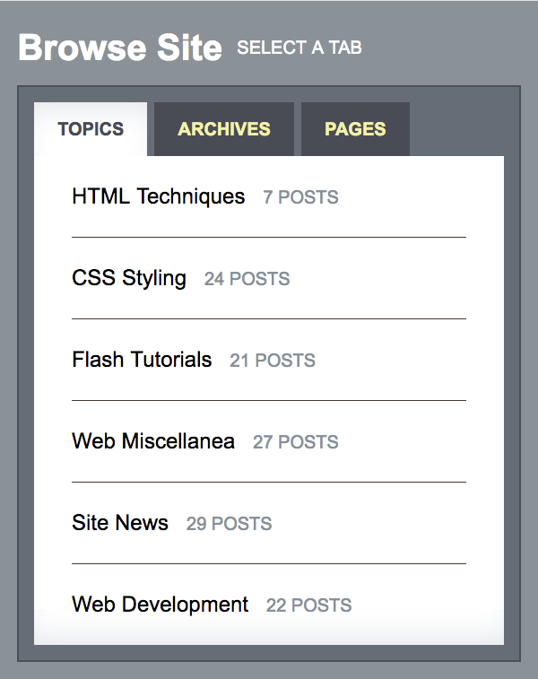

## Start server

```bash
$ php -S 127.0.0.1:8000
```

## Run frontend

```bash
$ yarn dev
```

## Preview



## To Do List

* [x] Create a PHP file to work as an ”API” exporting a JSON construct holding the information to build this task and call it with Javascript
* [x] Tabs
    * [x] Includes JS functionality
    * [x] Random tab selection on every page load
* [x] Lists
    * [x] In the "Topics" tab, the number of topics after the headline should count up from zero to a random number of posts animated with a nice transition
    * [x] In the second tab "Archives" please add several rows containing on the left a picture and on the right some random text
    * [x] In Pages Feel free to be creative and add some custom content
* [x] The solution should be responsive
* [x] Please use the following folder structure for your assets
    ```
    ├──css
    ├──img
    ├──js
    ├──index.html
    └──api.php
    ```
* [x] please do not use any frameworks or libraries
* [x] please do not use bootstrap or any other CSS framework
* [x] A plus would be to use a modern frontend workflow (ex. Grunt, Gulp, Webpack, …). However please bear in mind these are optional tasks just provide us with further visibility of your technical skills. They are not a must.

<details><summary><b>Sources</b></summary>
<p>

- `readable_random_string()` for dummy API content
  - https://gist.github.com/sepehr/3371339
- Basic tab script as base to work with
  - https://codepen.io/heydon/pen/veeaEa
  - https://css-tricks.com/tabs-its-complicated/
- Count up numbers from 0 to x
  - https://stackoverflow.com/a/16994725

</p>
</details>
